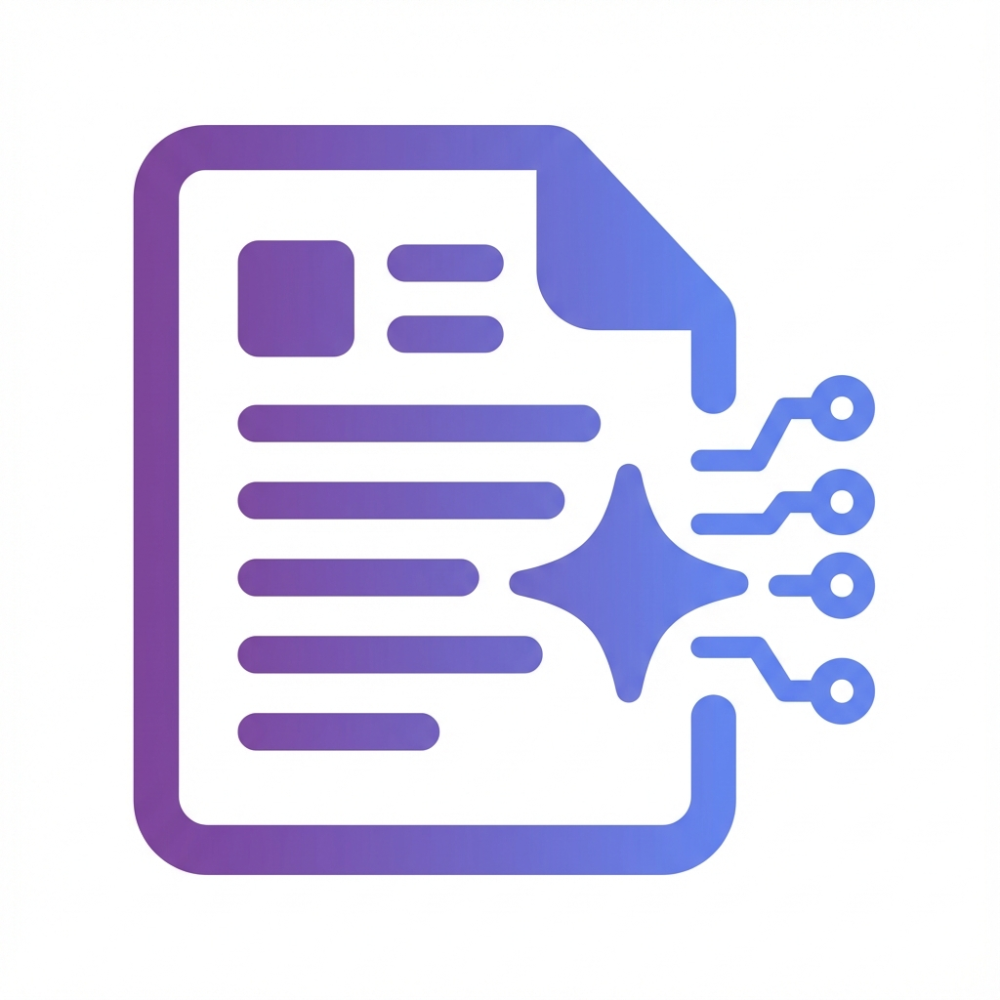

# 1-Click Job Summary 🚀

An AI-powered Chrome extension that instantly summarizes job postings in a clean, modern sidebar. Built with Gemini AI for intelligent content analysis.



## 📋 Table of Contents

- [Overview](#overview)
- [Features](#features)
- [Tech Stack](#tech-stack)
- [Project Structure](#project-structure)
- [Setup Instructions](#setup-instructions)
  - [Backend Setup](#backend-setup)
  - [Extension Setup](#extension-setup)
- [How to Use](#how-to-use)
- [Testing](#testing)
- [Architecture](#architecture)
- [Security](#security)
- [Production Roadmap](#production-roadmap)
- [Troubleshooting](#troubleshooting)

## 🎯 Overview

This extension helps job seekers quickly understand job postings by:
- Reading visible content from job posting pages (no web scraping)
- Analyzing the content using Google's Gemini AI
- Presenting a structured, easy-to-read summary in a sidebar
- Allowing customization of summary style and focus

**This is a production-aware MVP** - built with clean architecture that can scale to full production without major rewrites.

## ✨ Features

### Core Functionality
- ✅ One-click job posting analysis
- ✅ AI-powered content extraction
- ✅ Structured summaries with 5 key sections:
  - Role Overview
  - Required Skills
  - Qualifications
  - Nice to Have
  - Tech Stack Detection

### Customization Options
- **Length**: Short, Medium, or Detailed
- **Focus**: Skills, Qualifications, Responsibilities, or Balanced
- **Format**: Bullet points or Paragraphs

### UI/UX
- Clean, modern sidebar design
- Smooth slide-in/out animations
- Loading and error states
- Responsive layout
- Premium visual design with gradient accents

## 🛠 Tech Stack

### Frontend (Extension)
- **Chrome Extension Manifest V3**
- **Vanilla JavaScript** - No frameworks, maximum performance
- **HTML5 + CSS3** - Modern, responsive UI
- **Chrome APIs** - Minimal permissions (`activeTab`, `scripting`)

### Backend (API)
- **Node.js + Express** - Lightweight, fast server
- **Google Gemini AI** - Advanced language model
- **CORS** - Cross-origin support
- **dotenv** - Secure environment variable management

## 📁 Project Structure

```
1ClickSummary/
├── extension/                  # Chrome extension files
│   ├── manifest.json          # Extension configuration (Manifest V3)
│   ├── background.js          # Service worker (handles icon clicks)
│   ├── content.js             # Content script (manages sidebar)
│   ├── icons/                 # Extension icons (16, 48, 128px)
│   ├── sidebar/               # Sidebar UI
│   │   ├── sidebar.html       # Sidebar structure
│   │   ├── sidebar.css        # Sidebar styling
│   │   └── sidebar.js         # Sidebar logic & API calls
│   └── utils/
│       └── extractJobText.js  # Job content extraction utility
│
├── backend/                    # Backend API service
│   ├── server.js              # Express server entry point
│   ├── package.json           # Dependencies
│   ├── .env.example           # Environment variables template
│   ├── .gitignore             # Git ignore rules
│   ├── routes/
│   │   └── summarize.js       # POST /summarize endpoint
│   └── services/
│       └── geminiService.js   # Gemini AI integration
│
└── README.md                   # This file
```

## 🚀 Setup Instructions

### Prerequisites

- **Node.js** (v18 or higher) - [Download here](https://nodejs.org/)
- **Google Chrome** browser
- **Gemini API Key** - [Get one here](https://makersuite.google.com/app/apikey)

### Backend Setup

1. **Navigate to the backend directory:**
   ```bash
   cd backend
   ```

2. **Install dependencies:**
   ```bash
   npm install
   ```

3. **Configure environment variables:**
   ```bash
   cp .env.example .env
   ```

4. **Edit the `.env` file and add your Gemini API key:**
   ```
   GEMINI_API_KEY=your_actual_api_key_here
   PORT=3000
   ```

5. **Start the server:**
   ```bash
   npm start
   ```

   You should see:
   ```
   ✅ 1-Click Job Summary API is running
   📡 Server: http://localhost:3000
   🏥 Health: http://localhost:3000/health
   🤖 Gemini API: Connected
   
   Ready to process job summaries! 🚀
   ```

6. **Verify the server is running:**
   ```bash
   curl http://localhost:3000/health
   ```

### Extension Setup

1. **Open Chrome and go to:**
   ```
   chrome://extensions/
   ```

2. **Enable "Developer mode"** (toggle in top-right corner)

3. **Click "Load unpacked"**

4. **Select the `extension` folder** from this project:
   ```
   /path/to/1ClickSummary/extension
   ```

5. **The extension should now appear** in your extensions list

6. **Pin the extension** to your toolbar (optional but recommended)

## 📖 How to Use

1. **Start the backend server** (if not already running):
   ```bash
   cd backend
   npm start
   ```

2. **Navigate to any job posting** in Chrome
   - Examples: LinkedIn, Indeed, company career pages, etc.

3. **Click the extension icon** in your toolbar
   - The sidebar will slide in from the right

4. **Configure your summary preferences** (optional):
   - Choose length: Short, Medium, or Detailed
   - Select focus: Balanced, Skills, Qualifications, or Responsibilities
   - Pick format: Bullets or Paragraph

5. **Click "Summarize"**
   - The extension reads the visible page content
   - Sends it to the backend API
   - Gemini AI analyzes and structures the information
   - Summary appears in the sidebar

6. **Click the × button** to close the sidebar

## 🧪 Testing

### Test the Backend API

```bash
# Health check
curl http://localhost:3000/health

# Test summarize endpoint
curl -X POST http://localhost:3000/summarize \
  -H "Content-Type: application/json" \
  -d '{
    "jobText": "We are seeking a Senior Full-Stack Developer with 5+ years of experience. Strong skills in React, Node.js, and AWS required. Bachelor degree in CS preferred.",
    "length": "medium",
    "focus": "balanced",
    "format": "bullets"
  }'
```

### Test the Extension

1. **Test on real job postings:**
   - **LinkedIn**: https://www.linkedin.com/jobs/
   - **Indeed**: https://www.indeed.com/
   - **Stack Overflow Jobs**: https://stackoverflow.com/jobs
   - **Company career pages**

2. **Test different configurations:**
   - Try "short" vs "detailed" length
   - Compare "skills" vs "qualifications" focus
   - Test "bullets" vs "paragraph" format

3. **Test error handling:**
   - Try on a non-job page (should show appropriate message)
   - Stop the backend (should show connection error)
   - Test on pages with minimal content

## 🏗 Architecture

### Communication Flow

```
User clicks icon
    ↓
background.js (Service Worker)
    ↓
content.js (Injects sidebar, extracts content)
    ↓
sidebar/sidebar.js (User configures & clicks "Summarize")
    ↓
POST /summarize (Backend API)
    ↓
geminiService.js (Gemini AI analysis)
    ↓
Structured JSON response
    ↓
sidebar.js (Renders summary)
```

### Key Design Decisions

1. **Minimal Permissions**: Only `activeTab` and `scripting` - no broad access
2. **No Data Storage**: Job content is never persisted
3. **API Key Security**: Gemini key stays on backend, never exposed to extension
4. **Clean Separation**: Extension UI ↔ Backend ↔ AI Service are fully decoupled
5. **Manifest V3**: Future-proof with latest Chrome extension standards

## 🔒 Security

### Current Implementation

✅ **API key protected** - Never exposed to client  
✅ **Minimal permissions** - Only accesses active tab when clicked  
✅ **Input validation** - Backend validates all requests  
✅ **CORS enabled** - Controlled cross-origin access  
✅ **No data persistence** - Job content not stored anywhere  

### Production Considerations

When scaling to production, add:

- **Rate limiting** (e.g., express-rate-limit)
- **API authentication** (API keys, JWT tokens)
- **Request signing** to prevent tampering
- **Strict CORS** (whitelist specific origins)
- **Logging & monitoring** (Winston, DataDog)
- **Error tracking** (Sentry)
- **Caching layer** (Redis) for repeated summaries

## 🎯 Production Roadmap

This MVP is designed to evolve gracefully. Here's how to scale:

### Phase 1: MVP Enhancement (Current)
- ✅ Core summarization
- ✅ Customization options
- ✅ Clean UI

### Phase 2: User Accounts & Persistence
- Add user authentication (Firebase, Auth0)
- Save summary history
- User preferences persistence
- Chrome extension storage for offline access

### Phase 3: Advanced Features
- **Resume matching**: Compare job requirements to user's resume
- **Job tracking**: Save and organize interesting positions
- **Application prep**: Generate custom cover letters
- **Interview prep**: Extract likely interview questions

### Phase 4: SaaS Model
- **Freemium tier**: 10 summaries/month free
- **Premium tier**: Unlimited + advanced features
- **Team plans**: For recruiting companies
- **Analytics**: Track application success rates

### Phase 5: Scale Infrastructure
- **Multi-region deployment** (AWS, GCP)
- **CDN for assets** (CloudFlare)
- **Database** (PostgreSQL, MongoDB)
- **Queue system** (Redis, RabbitMQ)
- **Auto-scaling** based on load

### Easy Upgrades (No Rewrites Needed)

The current codebase supports adding:
- **Database**: Just add a DB service in `backend/services/`
- **Authentication**: Add auth middleware to routes
- **Caching**: Add Redis service, check cache before Gemini call
- **Rate limiting**: Add middleware in `server.js`
- **Logging**: Replace `console.log` with Winston/Pino

## 🐛 Troubleshooting

### Backend Issues

**Problem**: Server won't start  
**Solution**: 
- Check if port 3000 is already in use
- Verify `.env` file exists with valid `GEMINI_API_KEY`
- Run `npm install` to ensure dependencies are installed

**Problem**: "GEMINI_API_KEY is not set" error  
**Solution**: 
- Copy `.env.example` to `.env`
- Add your actual Gemini API key to `.env`

**Problem**: CORS errors in browser console  
**Solution**: 
- Ensure backend is running on `http://localhost:3000`
- Check that CORS is enabled in `server.js`

### Extension Issues

**Problem**: Extension doesn't appear in toolbar  
**Solution**: 
- Go to `chrome://extensions/`
- Ensure "Developer mode" is ON
- Click "Load unpacked" and select the `extension` folder

**Problem**: Sidebar doesn't appear when clicking icon  
**Solution**: 
- Refresh the job posting page
- Check browser console for errors (F12)
- Verify content script loaded: check Console for "[Content] Job Summary extension content script loaded"

**Problem**: "Failed to generate summary" error  
**Solution**: 
- Ensure backend server is running
- Check backend console for error messages
- Verify your Gemini API key is valid
- Check network tab for failed requests

**Problem**: Summary is empty or incomplete  
**Solution**: 
- The page might not have enough content
- Try on a different job posting
- Check if the page structure is unusual (non-standard job site)

### Content Extraction Issues

**Problem**: "Not enough content detected" message  
**Solution**: 
- Ensure you're on an actual job posting page (not search results)
- Some pages load content dynamically - wait for full page load before clicking extension
- Try scrolling down the page first

## 📝 Development Notes

### Code Style
- **Comments**: Every file has a purpose explanation at the top
- **Functions**: Self-documenting names, clear responsibilities
- **Error handling**: Comprehensive try/catch blocks
- **Logging**: Informative console messages for debugging

### Project Philosophy
- **Keep it simple**: No premature optimization
- **Modular**: Easy to add/remove features
- **Readable**: Code should be self-explanatory
- **Upgradeable**: Easy path to production

## 📄 License

MIT License - feel free to use this for learning or building your own tools!

## 🙌 Acknowledgments

- Built with [Google Gemini AI](https://deepmind.google/technologies/gemini/)
- Inspired by the need for better job search tools
- Designed as a teaching example of production-aware MVP development

---

**Questions or Issues?** Open an issue on GitHub or check the troubleshooting section above.

**Happy job hunting! 🎯**
